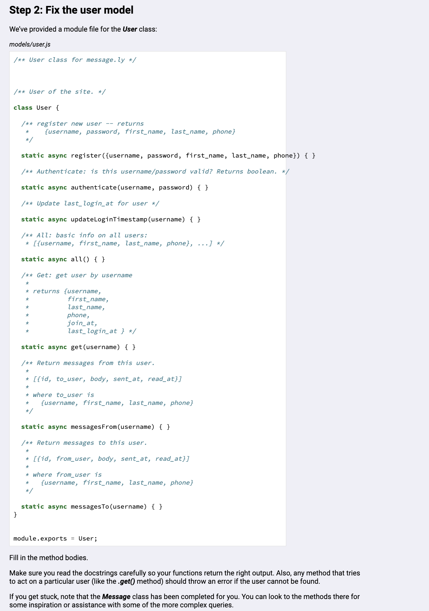
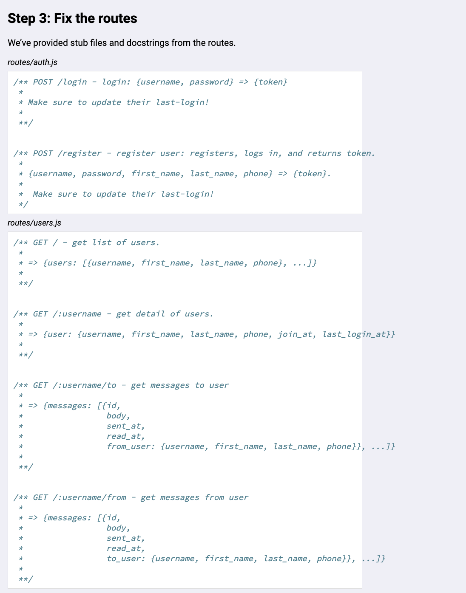
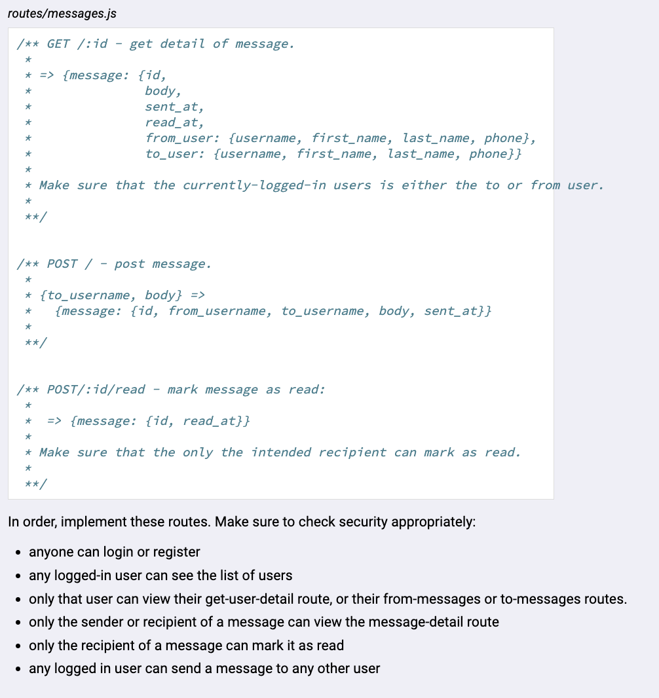

# A user-to-user private messaging application built using Node.js, Express, and PostgreSQL.

# Completed, fixed, and refactored the two models in /models and the three routes in /routes, given the requirements below. 

